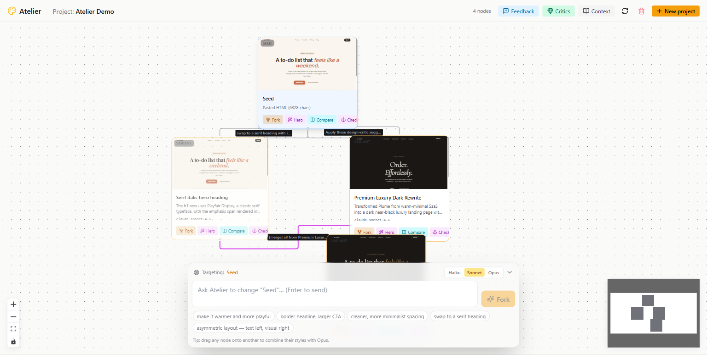

# Atelier

> **Branch every critique. Cite every source.**
> An infinite canvas for iterating on landing pages with AI that cites its references.

Atelier was built for the [Push to Prod Hackathon with Genspark & Claude](https://devfolio.co/hackathons/push-to-prod) (Singapore, 2026-04-24) — a 5-hour sprint on **internal workflow problems solved with AI**.

---

## The internal-workflow problem

Every product team has the same broken loop: PM says "make it more premium," designer tries three things in parallel and loses two, stakeholder replies "no, more like Aesop." AI tools make it worse — one-shot regeneration overwrites the last variant, and *"use a more modern palette"* is meaningless advice.

**Atelier fixes the loop.** Every critique is a branch on an infinite canvas you can see, compare, and keep. Every suggestion is **grounded in real landing pages crawled from the open web** — so "make it premium" arrives as *"swap Inter for Cormorant Garamond 700 italic, use Aesop's #EDE5D8 parchment, ghost outlined CTA."*



---

## How the sponsor stacks are used

### Claude (Anthropic)

Claude is the brain of every generative moment. Five distinct integrations, each model picked for the job:

| Flow | Model | What it does |
|---|---|---|
| **Fork rewrites** | Haiku 4.5 / Sonnet 4.6 / Opus 4.7 (user's pick) | Rewrites the full HTML given the user's instruction + project context. Streams back via SSE. |
| **Model shootout** | Haiku + Sonnet + Opus in parallel | Same prompt, three models, three sibling variants — bake-off in one click. |
| **Design Critics** | Sonnet | Strict-JSON suggestions `{category, severity, rationale}`, grounded in Genspark-crawled references. |
| **Drag-to-combine merge** | Opus | Synthesizes two siblings; preserves the target's structure, imports chosen aspects from the source. |
| **Componentize-to-React** | Sonnet | One-shot rewrite of a variant into a Vite + React + Tailwind project (one component per section). |

- **Prompt caching** on every long system prompt via `cache_control: ephemeral` → ~90% cost drop on follow-up calls in the 5-minute window.
- **BYOK** at runtime via `POST /settings/api-key`, or env `ANTHROPIC_API_KEY`. `/settings/status` reports which is active so the UI can warn.
- **Strict-pin retry loop**: when a `kind: "color"` Style Pin is marked strict and Claude's output omits the exact hex, the server re-prompts once with a violation report before persisting.
- Code: [apps/api/atelier_api/providers/claude.py](apps/api/atelier_api/providers/claude.py)

### Genspark

Genspark's `@genspark/cli` (`gsk` binary) is the **grounded research layer for Critics**. When the user toggles **"Ground with Genspark research"**:

1. `gsk web_search "<theme> landing page design"` → top 6 URLs.
2. Parallel `gsk crawler` fan-out on the top 3 → full page markdown.
3. Markdown injects into Claude's critic prompt as `"REAL-WORLD REFERENCES"`.
4. Suggestions come back like *"Replace terracotta with burnished gold #B89A5A — the luxury category consensus on Dribbble"* with clickable citation chips.

- Why crawler-fan-out instead of `batch_crawl_url_and_answer`: the batch endpoint returned `"No content found"` on every URL on the free plan; individual crawls returned full markdown. Still ~10s for 3 sites.
- Graceful fallback: missing `GENSPARK_API_KEY` or missing `gsk` binary → feature silently degrades to Claude-only.
- Windows fix: `gsk.CMD` can't be exec'd by `asyncio.create_subprocess_exec` (WinError 193). We offload to a thread via `asyncio.to_thread(subprocess.run)`.
- Code: [apps/api/atelier_api/providers/genspark.py](apps/api/atelier_api/providers/genspark.py)

---

## What you can do

**Iteration & generation**
- Fork from any node — short prompt, model dropdown (Haiku / Sonnet / Opus), live SSE stream of per-step timing.
- **Model shootout** — same prompt, three siblings, one per model. Fork any variant card straight into a bake-off.
- **Cost-fan confirm dialog** before any fork ≥2 variants — shows estimated `$x.xx × N` so nobody fan-outs by accident.
- **Strict color-pin enforcement** — strict pins get a one-shot re-prompt round if the exact hex is missing.
- Drag one variant onto another → Opus merges, dashed edges show which parent contributed what.
- Paste a stakeholder paragraph → Sonnet decomposes it into atomic change items (AutoReason-style); user approves the checklist.

**Project setup**
- New Project dialog: pick a **template** (six curated aesthetics with vibe chips and live iframe thumbnails), **paste HTML**, or **seed from URL**.
- Optional **Brand Kit** step in the same dialog — palette / type / voice fields → pre-loaded Style Pins on create, soft by default.
- Six templates ship with believable fake brands (Plume, Solenne, etc.) so first-fork output looks real.

**Constraints (Style Pins)**
- Typed schemas: **color** (color picker + hex), **dimension** (number + unit dropdown), **enum** (e.g. font-weight 300–900), **font** (datalist of common families), **text** (free).
- Per-pin **strict** toggle escalates prompt language to "ABSOLUTE / NON-NEGOTIABLE" and (for color) gates the retry loop.
- Quick-add presets grouped **Visual** + **Voice & copy** — designers and copywriters share the same panel.
- Max 12 pins per project; injected into every fork + critic prompt.

**Comparing variants**
- Compare any two nodes in the **side-by-side / split / overlay** viewer. `1` / `2` / `3` switch Desktop / Tablet / Mobile viewports; `S` / `D` / `O` switch modes.
- **Diff lens** sidebar with categories: **Copy** (heading/CTA rewrites with before/after side-by-side), **Tokens** (CSS custom-property changes), **Structure** (added/removed elements), **Typography**, **Palette**, **Spacing**, **Effects**, **Layout**. Token-aware: consumer-side `var(--x)` diffs are suppressed when their token already moved.

**Cost transparency**
- Per-variant **cost pill** on every card showing the spend on that fork.
- Project-wide **cost chip** in the top bar; Context Panel exposes a soft **cost cap** (USD).
- When a fork would exceed the cap, the SSE job emits `cost-capped` and a persistent **CostCapBanner** appears with an **"Open Project Context"** CTA that scrolls to and pulses the cap input.
- Sync `/fork` returns HTTP 402 with the same message — PromptBar routes the error into the same banner.

**Sharing & handoff**
- **Publish-to-URL** — beta. Variant tree copies into `assets/published/<slug>/`; mirrored to Supabase under `published/<slug>/...` when configured. Sandbox-server serves at `/p/<slug>/`. Re-publish is wipe-then-copy so removed assets don't leak.
- **Export as HTML** (copy or download), **ZIP** (HTML + every media asset), or **React project** — Sonnet rewrites the HTML into a Vite + Tailwind scaffold (one component per section), streamed as a `.zip`.
- Delete-node and delete-project clean up local + Supabase storage AND any published-tree leftovers.

**Workspace hygiene**
- Archive / restore projects from the dashboard — soft-flag in `project.settings`, hidden by default with a "Show N archived" toggle.
- Modal stacking guard so re-opening a dialog from another doesn't double-mount.
- Single **ErrorToast** (no native `alert()`); all error paths route through it.

---

## Architecture

```
Browser (Vite + React 18 + React Flow + Tailwind)
   │
   ▼
FastAPI (Python 3.11, SQLAlchemy async, SSE jobs via asyncio.Queue)
   │
   ├── Claude (Anthropic SDK, prompt caching) — fork, critics, merge, feedback, react-export
   ├── Genspark (gsk CLI: web_search + crawler) — critics grounding
   ├── MiniMax (image-01, T2V-01-Director) — optional hero media
   │
   ├── SQLite (local)  ─ or ─  Postgres via Supabase session pooler (hosted)
   └── Storage backend: local disk (dev) | Supabase Storage bucket (hosted)
         └── sandbox-server on :4100 — proxies variant iframes with the right Content-Type
              (Supabase forces text/plain on HTML; the proxy fixes that and serves /p/<slug>/)
```

---

## Setup

**Requirements:** Node ≥ 20, Python ≥ 3.11, bash/zsh shell, Anthropic API key. Optional: Genspark API key + `@genspark/cli` (for grounded critics), MiniMax key (for hero media).

```bash
# 1. Clone + configure
git clone https://github.com/bchuazw/atelier.git
cd atelier
cp .env.example .env.local
# edit .env.local: ANTHROPIC_API_KEY=sk-ant-...   (GENSPARK_API_KEY, MINIMAX_API_KEY optional)

# 2. Install deps
cd apps/api && pip install -e . && cd ../..
cd apps/web && npm install && cd ../..

# 3. (Optional) grounded critics
npm install -g @genspark/cli

# 4. Run all three services in parallel
npm run dev          # or: bash scripts/dev.sh
# → API :8000, sandbox-server :4100, web :3000 — open http://localhost:3000
```

### Environment variables

| Var | Required? | Purpose |
|---|---|---|
| `ANTHROPIC_API_KEY` | yes | Claude calls (or pass via UI BYOK at runtime) |
| `GENSPARK_API_KEY` | optional | Grounded critics (with `@genspark/cli`) |
| `MINIMAX_API_KEY` | optional | Hero image / video generation |
| `ATELIER_DB_URL` | optional | Defaults to local SQLite; set to Postgres URL for hosted |
| `ATELIER_STORAGE_MODE` | optional | `local` (default) or `supabase` |
| `SUPABASE_URL` / `SUPABASE_SERVICE_KEY` / `SUPABASE_BUCKET` | hosted | Storage bucket (default bucket: `variants`) |
| `ATELIER_SANDBOX_PUBLIC_URL` | hosted | Public URL of the sandbox proxy (mints `/p/<slug>/` URLs) |
| `ATELIER_ALLOWED_ORIGINS` | hosted | Comma-separated CORS origins |

---

## Repo layout

```
atelier/
├── apps/
│   ├── api/                    # FastAPI + SQLAlchemy + Python 3.11
│   │   └── atelier_api/
│   │       ├── providers/      # claude.py, genspark.py, minimax.py
│   │       ├── routes/         # projects, nodes, fork, media, merge, feedback, critics, settings
│   │       ├── db/             # models.py, session.py
│   │       ├── sandbox/        # fetcher, mutator
│   │       └── storage/        # local + supabase backends
│   └── web/                    # Vite + React 18 + Tailwind + React Flow
│       └── src/
│           ├── components/     # Canvas, VariantNode, BeforeAfterViewer, ForkDialog,
│           │                   #   MergeDialog, FeedbackDialog, CriticsDialog, ExportDialog,
│           │                   #   NewProjectDialog (+Brand Kit), ContextPanel, CostCapBanner,
│           │                   #   ErrorToast, EmptyState, TopBar, PromptBar, …
│           └── lib/            # api.ts, diffStyles.ts, store.ts
├── sandbox-server/             # Node static proxy for /variant/<id>/* and /p/<slug>/*
├── scripts/dev.sh              # one-shot dev runner
├── render.yaml                 # 3-service Render blueprint
└── PLAN.md                     # full design spec
```

---

## API surface (v1)

```
# Projects
GET    /api/v1/projects                                ?include_archived=true
POST   /api/v1/projects                                { name, seed_url? | seed_html?, style_pins? }
GET    /api/v1/projects/:id/tree                       ?include_archived=true
PATCH  /api/v1/projects/:id                            { context?, style_pins?, cost_cap_cents?, archived?, name?, active_checkpoint_id? }
DELETE /api/v1/projects/:id

# Nodes
GET    /api/v1/nodes/:id
PATCH  /api/v1/nodes/:id                               { position_x?, position_y?, pinned?, title? }
DELETE /api/v1/nodes/:id                               # cascades to descendants + storage + published slug
GET    /api/v1/nodes/:id/ancestors
GET    /api/v1/nodes/:id/export                        # → {html, media_assets[], lineage, sandbox_url}
GET    /api/v1/nodes/:id/export/zip                    # → application/zip
POST   /api/v1/nodes/:id/export/react                  # → {files, model_used, token_usage, cost_cents}
POST   /api/v1/nodes/:id/export/react/zip              # → application/zip
POST   /api/v1/nodes/:id/publish                       # → {slug, public_url, published_at}
GET    /api/v1/nodes/:id/publish

# Generative jobs (SSE-streamed)
POST   /api/v1/nodes/:id/fork/jobs                     { prompt, model, references? }
POST   /api/v1/nodes/:id/media/jobs                    { prompt, kind: image|video }
POST   /api/v1/nodes/:id/merge/jobs                    { source_id, aspects[], model }
GET    /api/v1/{flow}/jobs/:job_id/stream

# Analysis
POST   /api/v1/nodes/:id/feedback/analyze              { message, model? }
POST   /api/v1/nodes/:id/critics/analyze               { theme, aspects?, model?, use_grounding? }
```

---

## Deployment (Render + Supabase)

Three services in [render.yaml](render.yaml):

- `atelier-api` (Python) — FastAPI, installs `@genspark/cli` at build time
- `atelier-web` (Static) — Vite build, rewrites `/*` → `/index.html`
- `atelier-sandbox` (Node) — proxies variant + published iframes with correct `Content-Type`

Secrets per service: `ANTHROPIC_API_KEY`, `GENSPARK_API_KEY`, `MINIMAX_API_KEY`, `SUPABASE_URL`, `SUPABASE_SERVICE_KEY`, `ATELIER_DB_URL`, `ATELIER_STORAGE_MODE=supabase`, `ATELIER_SANDBOX_PUBLIC_URL`, `ATELIER_ALLOWED_ORIGINS`.

---

## What's new (April 2026)

- **Componentize-to-React export** — Sonnet rewrites a variant into a Vite + React + Tailwind project (one file per section), streamed as `.zip` with cost surfaced in response headers.
- **Token-aware diff lens** — CSS custom-property changes get their own `Tokens` category; consumer-side `var(--x)` noise is suppressed.
- **Publish-to-URL (beta)** — local + Supabase mirroring; hosted variants get a stable `/p/<slug>/` URL.
- **Cost cap polish** — persistent `CostCapBanner` with one-click jump to the cap input; PromptBar 402s flow into the same banner.
- **Per-project cost rollup + soft cap** — lifetime spend chip in the top bar; refusal pre-LLM if over cap.
- **Workspace hygiene** — archive / restore projects from the dashboard.
- **`delete_node`** now cleans up published slugs alongside variant trees.
- **Brand Kit step** in New Project — palette/type/voice → pre-loaded Style Pins.
- **Strict color pins** — regex match with hex boundary; one-shot re-prompt on violation.
- **Typed Style Pin schemas** — color picker, dimension+unit, enum, font datalist, text.
- **Diff lens** got a **Copy** tab with before/after rewrites side-by-side.
- **Cost pill** on every variant card; **structure diff** in the lens; **ErrorToast** replaces native alerts; voice-pin presets in Context Panel.

---

## License

MIT (intended). Repo is public at <https://github.com/bchuazw/atelier> for judge verification.
