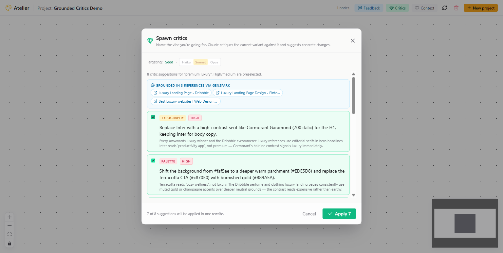
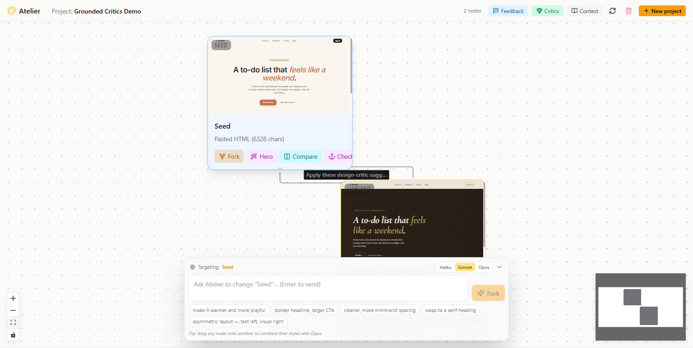
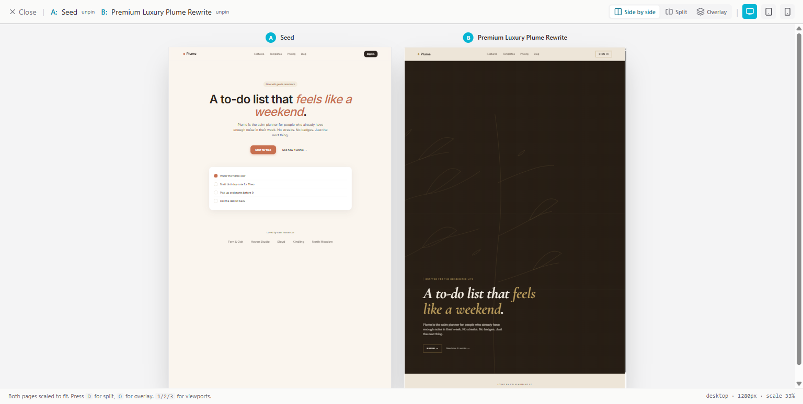
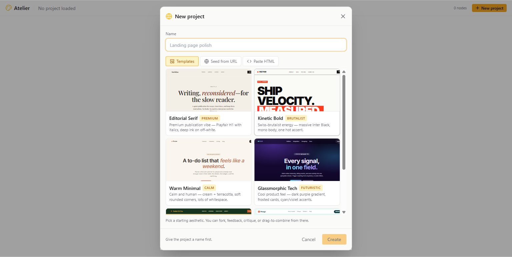

# Atelier

> **Branch, critique, and keep every round of design feedback.**
> An infinite canvas for iterating on landing pages with AI that cites its sources.

Atelier was built for the [Push to Prod Hackathon with Genspark & Claude](https://devfolio.co/hackathons/push-to-prod) (Singapore, 2026-04-24) — an 8-hour sprint on **internal workflow problems solved with AI**.

---

## The internal-workflow problem

Every product team has the same broken loop:

- A PM says "make it more premium."
- A designer tries three things in parallel, loses two.
- Stakeholder replies "no, more like Aesop."
- AI tools make it worse — one-shot regeneration overwrites the last variant, and *"use a more modern palette"* is meaningless advice.

**Atelier fixes the loop.** Every critique is a branch on an infinite canvas you can see, compare, and keep. Every suggestion is **grounded in real landing pages crawled from the open web** — so "make it premium" arrives as *"swap Inter for Cormorant Garamond 700 italic, use Aesop's #EDE5D8 parchment, ghost outlined CTA."*

📽 **Demo:** [`demo-video/atelier-demo.mp4`](demo-video/atelier-demo.mp4) (1920×1080 · 1:40 · 3.8 MB · ElevenLabs narration)



---

## How the sponsor stacks are used

### Claude (Anthropic)

Claude is the brain of every generative moment. Four distinct integrations, each model picked for the job:

| Flow | Model | What it does |
|---|---|---|
| **Fork rewrites** | Haiku 4.5 / Sonnet 4.6 / Opus 4.7 (user's pick) | Rewrites the full HTML given the user's instruction + project context. Streams back via SSE. |
| **Design Critics** | Sonnet | Returns strict-JSON suggestions with `{category, severity, rationale}` against a target theme. Grounded in Genspark-crawled references (see below). |
| **Drag-to-combine merge** | Opus | Synthesizes two sibling variants into a new branch. Preserves the target's structure, imports chosen aspects (typography / palette / layout / copy) from the source. |
| **Feedback decomposition (AutoReason-style)** | Sonnet | Extracts atomic change items from a multi-point stakeholder paragraph; user approves the checklist. |

- **Prompt caching** on the long system prompts (critics rubric, merge rubric) via `cache_control: ephemeral` → ~90% cost drop on follow-up calls within a 5-minute window.
- **BYOK** at runtime via `POST /settings/api-key`, or env `ANTHROPIC_API_KEY`. `/settings/status` reports which is active so the UI can warn.
- Code: [apps/api/atelier_api/providers/claude.py](apps/api/atelier_api/providers/claude.py)

### Genspark

Genspark's `@genspark/cli` (`gsk` binary) is wired in as a **grounded research layer for the Critics feature** — this is the integration that turns Claude's critiques from "AI slop" into "cite-your-sources."

When a user enables **"Ground with Genspark research"** in the Critics dialog:

1. Backend calls `gsk web_search "<theme> landing page design"` → top 6 URLs.
2. Parallel `gsk crawler` fan-out on the top 3 → full page markdown.
3. That markdown is injected into Claude's critics prompt as `"REAL-WORLD REFERENCES"` context.
4. Claude now returns suggestions like *"Swap Inter for Cormorant Garamond — every Awwwards luxury winner uses editorial serifs"* and *"Replace terracotta with burnished gold #B89A5A, matching Dribbble's luxury category consensus."*
5. The UI renders the reference URLs as clickable chips so users can verify citations.

- **Why crawler fan-out and not `batch_crawl_url_and_answer`?** We tried the batch endpoint first; on the free plan it returned `"No content found"` on every URL. Individual `crawler` calls on the same URLs returned full markdown. So we fan out — still fast (~10s for 3 sites on top of Claude's ~25s).
- **Graceful fallback:** missing `GENSPARK_API_KEY` or missing `gsk` binary → feature silently degrades to Claude-only. Users see a "Genspark returned no references" notice; nothing breaks.
- **Windows subprocess fix:** `gsk` resolves to `gsk.CMD` on Windows, which `asyncio.create_subprocess_exec` can't execute (WinError 193). We offload to a thread via `asyncio.to_thread(subprocess.run)`.
- Code: [apps/api/atelier_api/providers/genspark.py](apps/api/atelier_api/providers/genspark.py)

---

## What you can do in Atelier

- **Seed a project** from a URL, pasted HTML, or one of 6 curated aesthetic templates (Editorial Serif, Kinetic Bold, Warm Minimal, Glassmorphic Tech, Vintage Poster, Tropical Playful — each tagged with a one-word vibe chip).
- **Fork with Claude** from any node — type a prompt, pick your model, get a child variant with its full HTML rewritten. SSE stream shows per-step timing.
- **Spawn grounded critics** — name a target vibe, toggle Genspark grounding, get cited suggestions, approve a subset, one rewrite ships them all.
- **Drag one variant onto another** → MergeDialog fires, Opus combines them, dashed edges show which parent contributed what.
- **Paste stakeholder feedback** → Claude decomposes the paragraph into atomic change items (AutoReason-style); user approves the checklist.
- **Click Compare on any two nodes** → full-page side-by-side viewer with Desktop / Tablet / Mobile viewports (`1` / `2` / `3`), Split (draggable divider), and Overlay modes (`S` / `D` / `O`).
- **Export any variant** → Copy HTML, Download `.html`, or Download `.zip` (bundles HTML + every media asset). Built for "take the result to Cursor" flows.
- **Checkpoint a branch** → older siblings/ancestors archive (still in DB, hidden from default view) to keep the canvas fast. Toggle `Show archived` anytime.

---

## Architecture

```
┌──────────────────────────────────────────────────────────────────┐
│                         USER (browser)                            │
│                    atelier-web.onrender.com                       │
└────────────────────────────┬─────────────────────────────────────┘
                             │
               ┌─────────────┼─────────────┐
               │             │             │
               ▼             ▼             ▼
   ┌────────────────┐  ┌─────────┐  ┌──────────────────┐
   │  Render Static │  │ Render  │  │  Render Web      │
   │  Vite SPA      │  │ Node    │  │  FastAPI         │
   │  React Flow    │  │ sandbox │  │  Python 3.11     │
   │  Tailwind      │  │ proxy   │  │                  │
   └────────────────┘  └────┬────┘  └────┬─────────────┘
                            │            │
                            ▼            ▼
                    ┌───────────────────────────────┐
                    │      Supabase (US West)        │
                    │  • Postgres (variants tree)    │
                    │  • Storage (variant HTML + assets) │
                    └───────────────────────────────┘

External services the backend calls:
  • Anthropic (Claude Haiku/Sonnet/Opus) — every generative moment
  • Genspark (gsk CLI → web_search + crawler) — critics grounding
  • MiniMax (image-01, T2V-01-Director) — hero-media generation (optional)
```

- **Why React Flow over tldraw:** purpose-built for tree/graph UIs with custom interactive nodes. Each variant is a 260×300 card with a live iframe thumbnail.
- **Why SQLite → Postgres:** started single-user local; model code migrates to Postgres with a `DATABASE_URL` swap. Hosted uses Supabase session pooler (`aws-1-us-west-1.pooler.supabase.com:5432`) to sidestep Render's IPv6 limitation on direct Postgres hosts.
- **Why a separate sandbox-server:** Supabase Storage forces `text/plain` on HTML objects, which breaks iframe rendering. The sandbox server (80-line Node) proxies variant URLs with the correct `Content-Type`.
- **Why SSE over WebSockets:** streaming is one-way (server → client) for our flows; SSE gives auto-reconnect + works through every proxy. `asyncio.Queue` event bus in [apps/api/atelier_api/jobs.py](apps/api/atelier_api/jobs.py) fans events to connected clients per job.

---

## Setup

### Requirements

- **Node** ≥ 20 (tested on 25.6)
- **Python** ≥ 3.11 (tested on 3.12)
- **Git Bash** or POSIX shell on Windows, or macOS/Linux bash/zsh
- **Anthropic API key** (required)
- **Genspark API key** + `@genspark/cli` installed globally (optional — required only for grounded critics)

### Install

```bash
# 1. Clone + configure
git clone https://github.com/bchuazw/atelier.git
cd atelier
cp .env.example .env.local
# edit .env.local:
#   ANTHROPIC_API_KEY=sk-ant-...
#   GENSPARK_API_KEY=gsk-...   (optional)
#   MINIMAX_API_KEY=...         (optional)

# 2. Install deps
cd apps/api && pip install -e . && cd ../..
cd apps/web && npm install && cd ../..

# 3. (Optional) Install Genspark CLI for grounded critics
npm install -g @genspark/cli
```

### Run

**One command** (all three services):

```bash
npm run dev
```

This starts the API (`:8000`), sandbox-server (`:4100`), and web (`:3000`) in parallel. Open **http://localhost:3000**.

**Three terminals** if you prefer:

```bash
# Terminal 1 — backend
cd apps/api && python -m uvicorn atelier_api.main:app --reload --port 8000

# Terminal 2 — sandbox server
cd sandbox-server && ATELIER_ASSETS_DIR=../assets node server.js

# Terminal 3 — frontend
cd apps/web && npm run dev
```

---

## Demo flow (2 minutes)

1. **Pick a template** from 6 curated aesthetics (or paste HTML / URL). Start from **Warm Minimal** for maximum contrast with luxury critiques.
2. **Open Critics** → theme `premium luxury` → toggle **Ground with Genspark research**. ~35s later, 8 suggestions with hex codes appear, each citing a real landing page (Aesop, Awwwards, Dribbble).
3. **Apply.** A new variant lands on the canvas as a child node. Before/after viewer auto-opens, both full pages side-by-side.
4. **Compare any two.** Click the `Compare` button on any node (Columns icon, cyan). TopBar pill guides the flow. Viewer opens, full-page side-by-side with viewport keys `1/2/3`.
5. **Drag one variant onto another** → Opus merges them. Dashed edges show which parent donated what.
6. **Export** any variant as HTML, or bundle HTML + media assets as `.zip`. Paste into Cursor / VS Code / your editor.

---

## Repo layout

```
atelier/
├── apps/
│   ├── api/                        # FastAPI + SQLAlchemy + Python 3.11
│   │   └── atelier_api/
│   │       ├── main.py
│   │       ├── providers/          # claude.py, genspark.py, minimax.py
│   │       ├── routes/             # projects, nodes, fork, media, merge, feedback, critics, settings
│   │       ├── db/                 # models.py, session.py
│   │       ├── sandbox/            # fetcher, mutator
│   │       └── storage/            # local + supabase backends
│   └── web/                        # Vite + React 18 + Tailwind + React Flow
│       └── src/
│           ├── components/         # Canvas, VariantNode, BeforeAfterViewer, ForkDialog,
│           │                       #   MediaDialog, MergeDialog, FeedbackDialog, CriticsDialog,
│           │                       #   ExportDialog, TopBar, PromptBar, NewProjectDialog, …
│           └── lib/api.ts          # all backend calls + SSE subscribe helpers
├── sandbox-server/                 # 80-line Node static proxy for /variant/<id>/*
├── demo-video/                     # capture.mjs, narrate.mjs, composition.html, narration.md
├── assets/                         # variant artifacts (gitignored)
├── render.yaml                     # 3-service Render blueprint
└── PLAN.md                         # full design spec (30+ pages)
```

---

## API surface

```
# Projects
GET    /api/v1/projects
POST   /api/v1/projects                 { name, seed_url? | seed_html? }
GET    /api/v1/projects/:id/tree        ?include_archived=true
PATCH  /api/v1/projects/:id             { context?, active_checkpoint_id?, clear_checkpoint? }
DELETE /api/v1/projects/:id

# Nodes
GET    /api/v1/nodes/:id
PATCH  /api/v1/nodes/:id                { position_x?, position_y?, pinned?, title? }
GET    /api/v1/nodes/:id/ancestors
GET    /api/v1/nodes/:id/export         # → {html, media_assets[], lineage, sandbox_url}
GET    /api/v1/nodes/:id/export/zip     # → application/zip (HTML + assets)

# Generative jobs (all SSE-streamed)
POST   /api/v1/nodes/:id/fork/jobs         { prompt, model }
POST   /api/v1/nodes/:id/media/jobs        { prompt, kind: image|video }
POST   /api/v1/nodes/:id/merge/jobs        { source_id, aspects[], model }
GET    /api/v1/{flow}/jobs/:job_id/stream

# Analysis
POST   /api/v1/nodes/:id/feedback/analyze  { message, model? }
POST   /api/v1/nodes/:id/critics/analyze   { theme, aspects?, model?, use_grounding? }
```

---

## Deployment (Render + Supabase)

Three Render services defined in [render.yaml](render.yaml):

- `atelier-api` (Python) — FastAPI, installs `@genspark/cli` at build time
- `atelier-web` (Static) — Vite build, rewrites `/*` to `/index.html`
- `atelier-sandbox` (Node) — proxies variant iframes with correct `Content-Type`

One Supabase project for:
- Postgres (via session pooler, IPv4)
- Storage bucket `variants` (public, HTML served via sandbox proxy)

To deploy:

1. Create services from `render.yaml` via `render blueprint deploy`
2. Set secrets in each service: `ANTHROPIC_API_KEY`, `GENSPARK_API_KEY`, `MINIMAX_API_KEY`, `SUPABASE_URL`, `SUPABASE_SERVICE_KEY`, `ATELIER_DB_URL`, `ATELIER_SANDBOX_PUBLIC_URL`, `ATELIER_ALLOWED_ORIGINS`.
3. Push → auto-deploys.

---

## Screenshots

| | |
|---|---|
|  |  |
| *Grounded Critics — Genspark pulls 3 live landing pages, Claude cites them with specific hex codes + typography* | *Canvas — every variant is a live-iframe node, edges show the prompt that spawned each child* |
|  |  |
| *Full-page Side-by-Side viewer comparing the seed (Warm Minimal) to the grounded-critics luxury variant* | *Template picker with vibe chips (PREMIUM / BRUTALIST / CALM / FUTURISTIC) and guided hints* |

## Status (2026-04-24)

- ✅ Feature-complete for submission (cycles 1–7)
- ✅ Local stack: fork, media, merge, feedback, critics (with Genspark grounding), drag-to-combine, export, compare, checkpoint — all verified end-to-end
- ✅ Render deploy: web + sandbox + API all live. Frontend at [atelier-web.onrender.com](https://atelier-web.onrender.com), API at `atelier-api-wpx8.onrender.com`
- ✅ 2-minute demo video with ElevenLabs narration (see [demo-video/final-plan.md](demo-video/final-plan.md))

See [PLAN.md](PLAN.md) for the cycle-by-cycle build log and architectural decisions.

---

## License

MIT (intended). The repo is public at <https://github.com/bchuazw/atelier> for judge verification.
